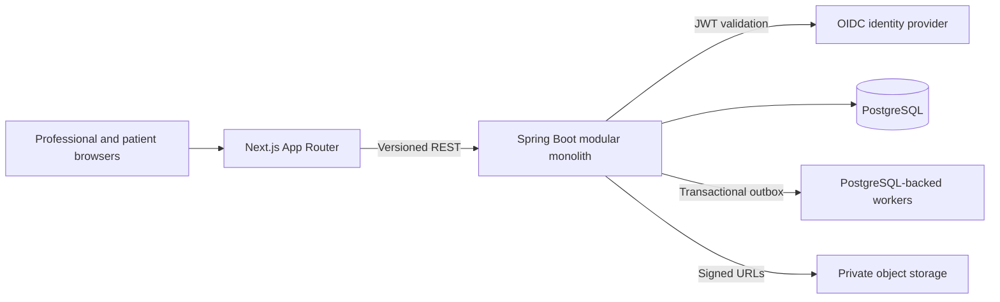

<div align="center">

# Vincelia

### Cuidado que continua.

Plataforma brasileira de cuidado nutricional para nutricionistas e pacientes.

[](https://github.com/igorjm/nutriotion-saas/actions/workflows/production-ci.yml)
[](https://openjdk.org/)
[](https://spring.io/projects/spring-boot)
[](https://nextjs.org/)
[](https://www.postgresql.org/)
[](LICENSE)

[Explore the prototype](https://nutrition-practice-prototype.igorjmelo4.chatgpt.site) · [Read the strategy](docs/product-strategy.md) · [Brand and interface](docs/brand-interface-foundation.md) · [Sprint 0 plan](docs/sprint-0-execution-plan.md)

</div>

> [!IMPORTANT]
> The Sprint 0 engineering foundation is complete, while founder-led discovery gates remain open. The first Sprint 1 vertical slice is in development. The deployed prototype remains a fictional, hardcoded UX reference. Do not use real patient data, clinical records, secrets, or production identifiers in development, tests, screenshots, or issues.

## The product thesis

Nutrition software should do more than produce a technically correct plan. It should help the professional understand what changed, make safe decisions quickly, support patient follow-through, and grow a sustainable practice.

This product is designed around three connected outcomes:

| Outcome | What the product supports |
| --- | --- |
| Better clinical continuity | Consultation preparation, structured records, plan versioning, and auditable publication |
| Better patient adherence | Clear daily guidance, professional-approved substitutions, lightweight check-ins, and progress context |
| Better professional growth | Ethical content planning, lead organization, and switching-oriented onboarding |

AI remains assistive throughout: it prepares drafts and summaries, while the nutritionist reviews and approves every clinically relevant change.

## Current surfaces

| Surface | Status | Purpose |
| --- | --- | --- |
| Interactive prototype | Available | Validates professional, patient, mobile, and acquisition workflows |
| Production public web | Foundation available | Positioning and consent-aware early-access capture |
| Professional web | Sprint 1 in development | Organization-scoped patient list and invitation flow |
| Modular API | Sprint 1 in development | Invitation, versioned consent, active relationship, audit, and outbox |
| Patient PWA | First entry flow available | Account, consent, and relationship confirmation; daily experience remains planned |

## Architecture



The production direction is intentionally conservative: a modular monolith, shared-schema multi-tenancy, versioned REST, generated clients, PostgreSQL-backed async work, and portable infrastructure boundaries. Microservices, Kafka, Redis, Kubernetes, GraphQL, and vector storage stay out until measured requirements justify them.

## Repository map

```text
.
├── app/                       # Preserved high-fidelity prototype
├── apps/web/                  # Production Next.js application
├── services/api/              # Java 25 / Spring Boot modular monolith
├── contracts/openapi/         # Source REST contract
├── packages/api-client/       # Generated TypeScript client
├── packages/brand/            # Typed working identity and source mark
├── packages/design-tokens/    # Shared visual tokens
├── infra/                     # Local and deployment templates
├── docs/                      # Strategy, ADRs, security, and runbooks
└── .github/                   # CI and collaboration workflows
```

The root prototype remains a UX reference. Production behavior is delivered as tested vertical slices under `apps/` and `services/`.

## Quick start

### Prototype

Prerequisites: Node.js 22.19 or newer in the Node 22 line and npm.

```bash
npm ci
npm run dev
```

Use the prototype switcher to move between the nutritionist, patient web, patient mobile concept, and acquisition surfaces.

### Production foundation

Prerequisites: Java 25, Node.js 22.19, npm, Docker, and Docker Compose.

```bash
docker compose -f infra/local/compose.yaml up -d postgres
SPRING_PROFILES_ACTIVE=dev ./services/api/mvnw -f services/api/pom.xml spring-boot:run
```

In a second terminal:

```bash
npm --prefix packages/api-client ci
npm --prefix apps/web ci
npm --prefix apps/web run dev
```

The development API accepts `X-Dev-Subject` only under the `dev` and `test` profiles. Those profiles must never run in a shared or production environment.

## Quality gates

Run the relevant checks before opening a pull request:

```bash
npm run check:local
npm --prefix packages/api-client run check
npm --prefix apps/web run check
./services/api/mvnw -f services/api/pom.xml verify
```

CI treats authorization and tenant isolation as release blockers. Database changes require forward-tested Flyway migrations. AI features require scenario evaluation, unsafe-response tests, traceability, and cost measurement before release.

## Product and engineering principles

- Visible customer copy is pt-BR; engineering documentation is English.
- The nutritionist remains the clinical decision-maker.
- Every practice is an `Organization`, including solo professionals.
- Tenant context is resolved from authenticated membership on the server.
- Patient understanding and adherence matter more than plan complexity.
- LGPD-sensitive health data is a first-order architecture concern.
- Small, demonstrable increments beat speculative platform work.

## Roadmap

- [x] Product strategy and high-fidelity workflow prototype
- [x] Production repository, CI, OpenAPI client, PostgreSQL, tenancy, audit, and threat-model foundations
- [x] Supabase Auth selection, local development, and fictional-data staging foundation
- [x] Professional invitation → patient account → consent → accepted relationship
- [ ] Self-service professional onboarding and Organization creation
- [ ] Consultation and assessment records
- [ ] Nutrition-plan drafting, versioning, and publication
- [ ] Patient plan and adherence PWA
- [ ] First evaluated, low-risk AI workflows

## Documentation

- [Product and engineering handoff](docs/HANDOFF.md)
- [Product strategy](docs/product-strategy.md)
- [Brand and interface foundation](docs/brand-interface-foundation.md)
- [Prototype brief](docs/prototype-brief.md)
- [Sprint 0 execution plan](docs/sprint-0-execution-plan.md)
- [Architecture decisions](docs/adr/)
- [Threat model](docs/security/threat-model.md)
- [Local development runbook](docs/runbooks/local-development.md)

## Contributing and security

Read [CONTRIBUTING.md](CONTRIBUTING.md) before proposing changes. Security concerns and suspected data exposure must follow [SECURITY.md](SECURITY.md) and must not be reported in a public issue.

## License

Copyright © 2026 Igor Melo. This is proprietary source-available software. No use, copying, modification, or distribution rights are granted without written permission. See [LICENSE](LICENSE).
